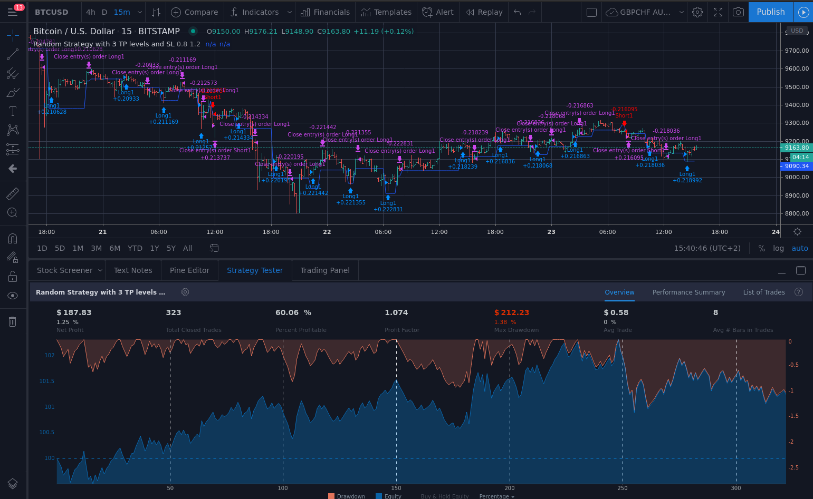

# Random Strategy
I wanted to know how good a random strategy is in forex-trading. Why? I don't know.
# Approach
I used a 3 level-take profit and a 1 level-stoploss. 
The stoploss was set at 1.2*atr and the takeprofit at 0.8, 1.2 and 1.6 times the atr.
Because Pinescript has no implemented random number generation, I created one based on
[Lehmer random number generator](https://en.wikipedia.org/wiki/Lehmer_random_number_generator).

The strategy can be seen here: [Random-Strategy-with-3-TP-levels-and-SL](https://www.tradingview.com/script/lfZvb4hY-Random-Strategy-with-3-TP-levels-and-SL-Kenfus/)
# Results 
The results were as expected. I had, with some tuning of the parameters for the Lehmer Random Number generator, amazing results.
However, those were of course heavily overfitted so I'm showing here a "random" one.

# Todo
It would be fun to completely overfit to the past data and get incredible results.
